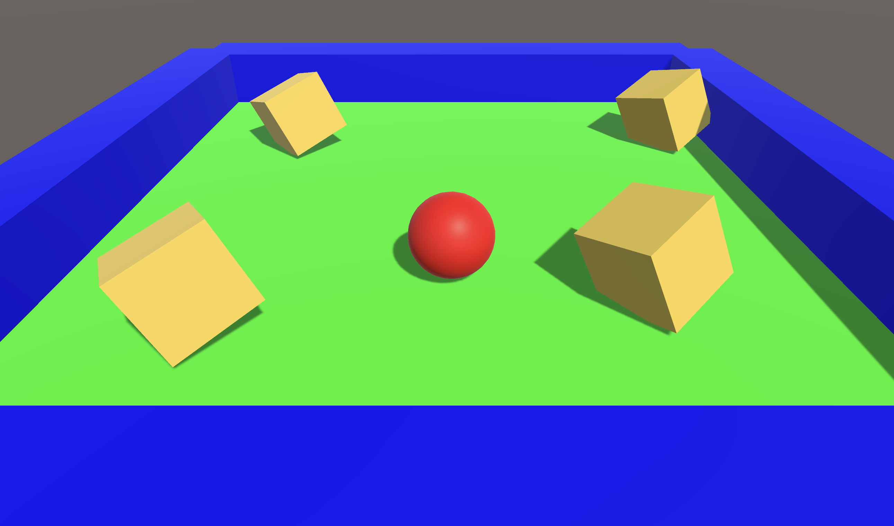

# RollingBallUnity
Rolling Ball tutorial game made in Unity

A simple 3D Unity game where the player controls a rolling ball to collect items in a scene

## Features
- Basic 3D physics and movement using Unity's Rigidbody
- Interactive item collection system
- Simple scene with obstacles and collectibles
- Built with Unity and C#

## Screenshots
